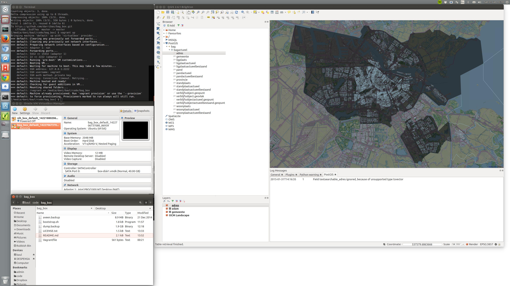

# `BAG` box

This repository contains the configuration files required to get a PostGIS database of the Dutch cadaster (`BAG`) up and running on a vagrant box. Once ready, you can access it from the host machine through [QGIS](http://qgis.org).

## Usage

* Make sure you have installed a recent version of
  [`VirtualBox`](https://www.virtualbox.org/) and
  [`Vagrant`](https://www.vagrantup.com/).
* Clone this repository and navigate into the folder.
* Run `vagrant up`. The first time, this will build the box (so it might take
  a while, depending on connection and power of your machine). Once built, it
  will only take a few seconds to make it boot up.
* At this point, the virtual machine (VM) is running and the PostGIS database
  is accessible from the host through the 15432 port. Connect to it from QGIS,
  for example, by using the QGIS browser. Select "Create a New PostGIS
  connection and enter the following info:

    * Name: `bag`
    * Host: `localhost`
    * Port: `15432`
    * Database: `bag`
    * Username: `kademo`
    * Password: `kademo`

* When you are done with the session, run `vagrant halt` to stop the VM. This
  will free up a few GB of RAM in your host machine.
* If you want to get rid of the VM, run `vagrant destroy` and things will
  dissapear as if they'd never happened. That easy.

**NOTE**: I've had problems pulling down the dump file (1.8GB via `wget`). If
you experience any issue while building the vagrant box, downloaded separately
and put it on the project folder with the name `dump.backup`. Then run
`vagrant destroy -f` to remove the box with the error, and re-build it with
`vagrant up`.

## License & Credits

This is released under a BSD-type open-source license. See `LICENSE.txt` for
details.

This project builds on the following:

* [Postgis dump](http://data.nlextract.nl/bag/postgis/) of the Dutch cadaster made by the good folks at
  [`NLExtract`](https://github.com/opengeogroep/NLExtract).
* [This tutorial](https://github.com/jackdb/pg-app-dev-vm) by JackDB, Inc.
  about how to setup a PostgreSQL database in vagrant and make is accessible
  to the host machine.
